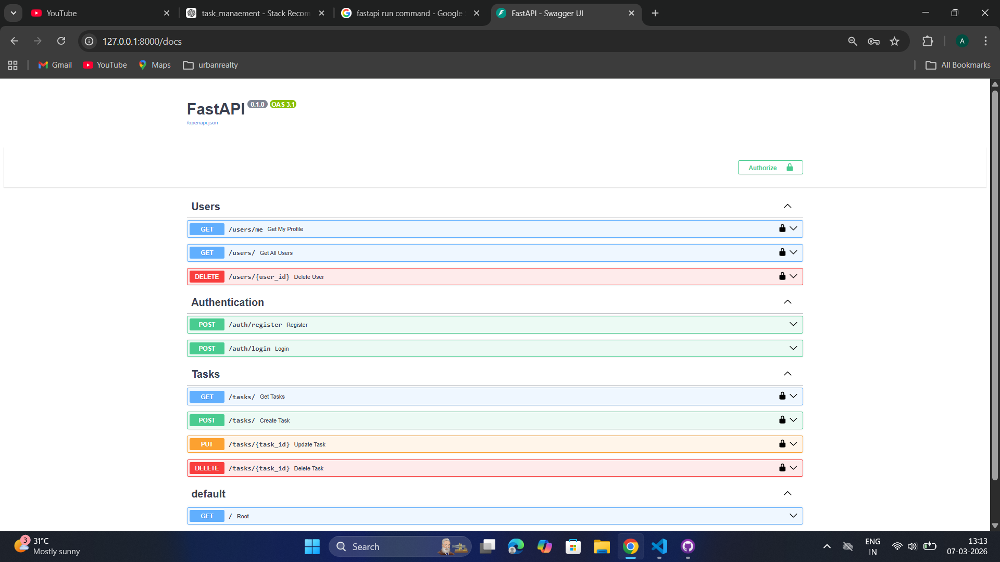

# Task Tracker API

A backend REST API built with FastAPI that allows users to register, login, and manage their own tasks.  
The system includes JWT authentication, role-based access control, and task CRUD operations.

This project was created as part of a backend engineering assignment.

---

## Tech Stack

- Python
- FastAPI
- SQLAlchemy ORM
- SQLite
- JWT Authentication (python-jose)
- Password Hashing (passlib / bcrypt)
- Pytest for testing

---

## Project Structure

task-tracker-api
│
├── src
│   ├── routes
│   │   ├── auth_routes.py
│   │   ├── task_routes.py
│   │   └── user_routes.py
│   │
│   ├── auth.py
│   ├── database.py
│   ├── models.py
│   ├── schemas.py
│   └── main.py
│
├── tests
│   ├── conftest.py
│   ├── test_auth.py
│   └── test_tasks.py
│
├── .env.example
├── requirements.txt
├── README.md
└── tasks.db

---

## Setup Instructions

### 1. Clone the repository

git clone <your-repository-link>  
cd task-tracker-api

---

### 2. Create virtual environment

python -m venv venv

Activate environment

Windows

venv\Scripts\activate

Mac / Linux

source venv/bin/activate

---

### 3. Install dependencies

pip install -r requirements.txt

---

### 4. Configure environment variables

Create a `.env` file based on `.env.example`

Example `.env`

SECRET_KEY=your_secret_key_here  
ALGORITHM=HS256  
ACCESS_TOKEN_EXPIRE_MINUTES=30

---

### 5. Run the server

python run.py

Server runs at

http://127.0.0.1:8000

Swagger API documentation

http://127.0.0.1:8000/docs

Swagger Interface

---

## Authentication

Authentication is implemented using JWT tokens.

After login the API returns a token:

Authorization: Bearer <JWT_TOKEN>

This token must be included in protected API requests.

---

## API Endpoints

### Authentication

Register user

POST /auth/register

Example request

{
  "username": "ajmal",
  "email": "ajmal@gmail.com",
  "password": "123456"
}

---

Login

POST /auth/login

Example response

{
  "access_token": "JWT_TOKEN",
  "token_type": "bearer"
}

---

## User Endpoints

Get current user

GET /users/me

Admin: get all users

GET /users

Admin: delete user

DELETE /users/{id}

---

## Task Endpoints

Create task

POST /tasks

Example request

{
  "title": "Finish backend assignment",
  "description": "Complete FastAPI project"
}

---

Get tasks

GET /tasks

Rules

User → see only their tasks  
Admin → see all tasks

---

Update task

PUT /tasks/{id}

Example

{
  "status": "completed"
}

---

Delete task

DELETE /tasks/{id}

---

## Security Features

- Password hashing using bcrypt
- JWT authentication
- Role-based access control
- Environment variables for secrets
- No credentials stored inside source code

---

## Running Tests

Tests are implemented using pytest.

Run tests

pytest

Example output

collected 4 items  
4 passed

Test coverage includes

- User registration
- Login authentication
- Task creation
- Task retrieval

---

## Evaluation Criteria Covered

- Clean project structure
- Secure authentication
- ORM database usage
- API design
- Input validation
- Automated tests
- Documentation

---

## Author

Ajmal P P